# KinexMed — Clinical Movement Intelligence and Multi-Exercise Rehabilitation Platform

[](https://github.com/KatkamKoushik/KinexMed/releases/tag/v1.2.0)
[-success.svg)](https://github.com/KatkamKoushik/KinexMed/releases/download/v1.2.0/app-debug.apk)
[](https://fastapi.tiangolo.com)
[](https://developer.android.com)
[](https://developers.google.com/mediapipe)
[](https://react.dev)
[](https://opensource.org/licenses/MIT)

> Prototype developed for **iQOO Hackathon 2026 — The Hyderabad City Battle**

**KinexMed** is an edge-native, real-time physical rehabilitation observation platform. It enables patients to perform prescribed physical therapy exercises under automated on-device observation using a standard Android smartphone, while streaming validated kinematic metrics to a clinician portal.

KinexMed operates on a strict **zero-mock-data integrity** principle: all telemetry, range-of-motion measurements, and repetition timestamps originate solely from live on-device anatomical landmark geometry.

---

## Latest Release & Android APK Download

The latest pre-compiled Android APK (**v1.2.0**) is available directly via GitHub Releases:

- **Direct APK Download:** [Download KinexMed v1.2.0 APK (`app-debug.apk`)](https://github.com/KatkamKoushik/KinexMed/releases/download/v1.2.0/app-debug.apk)
- **GitHub Release Page:** [KinexMed v1.2.0 Release Notes](https://github.com/KatkamKoushik/KinexMed/releases/tag/v1.2.0)
- **Local Build Output:** `android/app/build/outputs/apk/debug/app-debug.apk`

### Installing on Android Device via ADB

```bash
adb install -r android/app/build/outputs/apk/debug/app-debug.apk
```

---

## Team

This prototype was built by:

### Koushik Katkam
- Email: [koushikkatkam@gmail.com](mailto:koushikkatkam@gmail.com)
- GitHub: [https://github.com/KatkamKoushik](https://github.com/KatkamKoushik)
- LinkedIn: [https://linkedin.com/in/koushik-katkam](https://linkedin.com/in/koushik-katkam)
- Instagram: [https://instagram.com/koushik_katkam](https://instagram.com/koushik_katkam)

### Vyshnavi Nagavelli
- Email: [nagavellivyshnavi3@gmail.com](mailto:nagavellivyshnavi3@gmail.com)
- GitHub: [https://github.com/nagavellivyshnavi](https://github.com/nagavellivyshnavi)
- LinkedIn: [https://linkedin.com/in/vyshnavi-nagavelli-135465355/](https://linkedin.com/in/vyshnavi-nagavelli-135465355/)

### Nivedan Katkam
- Email: [nivedankatkam@gmail.com](mailto:nivedankatkam@gmail.com)
- GitHub: [https://github.com/nivedankatkam](https://github.com/nivedankatkam)
- LinkedIn: [https://www.linkedin.com/in/katkam-nivedan-442376272/](https://www.linkedin.com/in/katkam-nivedan-442376272/)


---

## Multi-Exercise Library (15 Modules Across 4 Categories)

KinexMed features a modular, extensible clinical exercise library organized into four therapeutic categories. Each exercise is assigned an explicit validation badge indicating its testing status:

### 1. Lower Body (8 Exercises)
- **Sit-to-Stand (Demonstrated):** Knee extension and hip angle tracking (target: >= 148 deg). Physically demonstrated on physical hardware with zero perceived latency and instant inflection detection.
- **Bilateral Squat (Implemented Module):** Sagittal knee angle tracking (target: <= 100 deg, optimal 90 deg) with side-preference hysteresis (+-0.08 confidence margin) and 138 deg upright lockout.
- **Forward Lunge (Implemented Module):** Lead knee flexion tracking (target: <= 100 deg).
- **Reverse Lunge (Implemented Module):** Lead knee flexion tracking (target: <= 100 deg).
- **Calf Raise (Implemented Module):** Ankle plantarflexion tracking (target: >= 115 deg).
- **Seated Knee Extension (Implemented Module):** Seated lower-leg extension tracking (target: >= 145 deg).
- **Standing Hip Abduction (Implemented Module):** Lateral leg raise angle tracking (target: <= 150 deg).
- **Standing Hip Extension (Implemented Module):** Posterior hip extension tracking (target: <= 152 deg).

### 2. Upper Body (4 Exercises)
- **Shoulder Flexion (Implemented Module):** Forward arm elevation angle tracking (target: >= 90 deg).
- **Shoulder Abduction (Implemented Module):** Lateral arm elevation angle tracking (target: >= 90 deg).
- **Elbow Flexion / Bicep Curl (Implemented Module):** Interior elbow flexion tracking (target: <= 70 deg).
- **Elbow Extension / Tricep (Implemented Module):** Posterior arm extension tracking (target: >= 145 deg).

### 3. Functional & Mobility (2 Exercises)
- **Marching in Place (Implemented Module):** Alternating hip flexion angle tracking (target: <= 110 deg).
- **Heel-to-Toe Rocking (Implemented Module):** Fluid ankle motion and stability cycle tracking (target: >= 112 deg).

### 4. Balance & Stability (1 Exercise)
- **Supported Single-Leg Balance (Implemented Module):** Single-leg elevation ratio and continuous stability hold duration tracking (target: >= 10.0s).

---

## System Architecture

```mermaid
flowchart LR
    subgraph Android["Android Edge Device (On-Device)"]
        Cam["CameraX Live Stream"] --> MP["MediaPipe Pose Landmarker (CPU Delegate)"]
        MP --> Filter["One-Euro Filter (beta=0.05)"]
        Filter --> Geom["Biomechanical Geometry & Side Hysteresis"]
        MP --> Evidence["Evidence & Framing Gate"]
        Geom & Evidence --> FSM["Deterministic Multi-Exercise FSMs"]
        FSM --> Audio["TTS Spoken Coaching & Hands-Free Countdown"]
        FSM --> Room["Room SQLite (Local-First Persistence)"]
        Room --> Sync["SyncManager (Dynamic Multi-Endpoint)"]
    end

    subgraph Backend["Backend (FastAPI)"]
        Sync -->|HTTP JSON POST| API["FastAPI REST Services"]
        API --> DB[(SQLAlchemy / SQLite)]
        API --> LLM["Grounded Dynamic Summaries"]
    end

    subgraph Web["Clinician Web Portal (React / Vite)"]
        DB --> Dashboard["Clinician Telemetry Dashboard"]
        Dashboard --> Charts["Dynamic ROM & Kinematic Visualizer"]
        Dashboard --> Reps["Repetition Quality Inspector"]
    end
```



---

## Key Technical Features

- **100% On-Device Processing:** Raw camera video frames are processed entirely in memory on the device CPU and discarded immediately. No video stream or personal photo ever leaves the phone.
- **Biomechanical Angle Extraction:** Calculates true Euclidean joint angles across upper and lower extremities with side-preference hysteresis (+-0.08 margin) to eliminate frame-to-frame switching jitter.
- **Sub-Millisecond Temporal Smoothing:** One-Euro filter tuned with beta = 0.05 for immediate velocity tracking without lagging rapid movement initiation while keeping static pose steady.
- **Hands-Free Start:** 1.5 seconds of continuous stable framing triggers an audible 5-second countdown ("5, 4, 3, 2, 1, Begin!") with auto-session start, allowing patients to position themselves 2.5m away without touching the screen.
- **Clinical Evidence Gate:** Verifies body containment, landmark confidence, camera distance, and side alignment before scoring repetitions.
- **Real-Time Auditory Coaching:** Event-driven voice feedback vocalizes rep counts and posture cues ("Rep 1! Good depth", "Stand all the way up").
- **Prescribed Exercise Plans:** Configurable rehabilitation regimens across 15 exercises specifying target sets, reps, and weekly frequency, managed on both Android and Web.
- **Consistency & Streak Engine:** Pure functional calculation querying real SQLite session timestamps to compute consecutive workout streaks, longest streak, and weekly goal adherence with zero mock data.
- **Weekly & Monthly Patient Progress:** Dedicated analytical screen providing WEEK and MONTH adherence toggles, volume metrics, and primary form failure breakdowns.
- **Dedicated Session Summary & Scoring:** Transparent form score model based on completed-to-attempted ratios and ROM depth achievement, with primary rejection cause analysis.
- **Caregiver Share Sheet:** Standard Android `Intent.ACTION_SEND` integration generating structured, privacy-safe text summaries for family and caregivers (zero raw video exposure).
- **Automated Clinical Adherence Reports:** Factual Session, Weekly, and Monthly reports generated via FastAPI endpoints and visualized on the clinician portal with one-tap text export.
- **Clinician Feedback Pipeline:** Direct consultation notes and form modification guidance attached to session records and rendered chronologically.
- **iQOO Office Kit Integration:** Documented phone-to-laptop integration bridging mobile edge computer vision with laptop clinician review via screen casting and local network telemetry.
- **Offline-First Local Persistence:** All session metadata, rep records, and evidence events are written to local Room SQLite first, then synchronized automatically via local ADB reverse, LAN IP, or dynamic Wi-Fi DHCP default gateway.
- **Clinician Web Portal:** Real-time dashboard displaying patient session histories, peak flexion curves, rep-by-rep durations, and evidence alerts with zero mock data.


---

## Repository Structure

```
KinexMed/
├── android/                 # Native Android Application (Kotlin)
│   ├── app/src/main/
│   │   ├── java/com/kinexmed/
│   │   │   ├── audio/       # Text-to-Speech Voice Feedback Manager
│   │   │   ├── data/        # Room Database, DAOs, Entities, Repository
│   │   │   ├── domain/      # FSM, Evidence Engine, Geometry, One-Euro Filter, Registry
│   │   │   ├── mediapipe/   # MediaPipe Pose Landmarker Helper (CPU Delegate)
│   │   │   ├── sync/        # Background Network SyncManager
│   │   │   └── ui/          # Activities, Canvas Overlays, UI Adapters
│   │   └── assets/          # MediaPipe Pose Landmarker models (.task)
│   └── build.gradle.kts     # Gradle build configurations
│
├── backend/                 # FastAPI Asynchronous REST Backend (Python)
│   ├── app/
│   │   ├── api/             # REST endpoints (/health, /sessions, /plans, /feedback, /reports)
│   │   ├── core/            # Database engine, SQLAlchemy session setup
│   │   ├── models/          # Database models (Session, Rep, EvidenceEvent, Plan, Feedback)
│   │   ├── schemas/         # Pydantic validation schemas (Session, Plan, Feedback)
│   │   └── services/        # Dynamic session summary generator
│   └── tests/               # Backend integration and endpoint tests

│
├── docs/                    # Architecture, Traceability, and Validation Documentation
│   ├── FINAL_IMPLEMENTATION_AUDIT.md # Comprehensive engineering & reality audit
│   ├── OFFICE_KIT_WORKFLOW.md   # iQOO Office Kit Phone-to-Laptop integration guide
│   ├── PPT_CODEBASE_GAP_MATRIX.md # Forensic PPT ↔ Codebase gap matrix
│   ├── PPT_REQUIREMENTS_TRACEABILITY.md # Master requirements traceability matrix
│   └── VALIDATION.md        # Physical testing matrix and performance benchmarks
│
├── web/                     # Clinician Dashboard Frontend (React + Vite)
│   ├── src/
│   │   ├── components/      # UI views (Overview, Sessions, Detail, Plans, Reports)
│   │   ├── api/             # Backend REST API client
│   │   └── App.tsx          # Main clinician portal view
│   └── package.json
└── .github/workflows/       # GitHub Actions CI workflow
    └── ci.yml

```

---

## Quick Start Guide

### 1. Prerequisites
- **Python**: 3.10+
- **Node.js**: 18+ (with `pnpm` or `npm`)
- **Android SDK**: API 26+ (Android 8.0+) with JDK 17
- **Physical Device**: Android phone with CameraX and USB/Wireless Debugging

---

### 2. Backend Setup (FastAPI)

```bash
cd backend

# Create and activate virtual environment
python -m venv .venv
source .venv/bin/activate  # On Windows: .venv\Scripts\activate

# Install dependencies
pip install -r requirements.txt

# Start backend server
python -m uvicorn app.main:app --host 0.0.0.0 --port 8000 --reload
```
Verify backend health at: `http://localhost:8000/health`

---

### 3. Clinician Web Portal Setup (React / Vite)

```bash
cd web

# Install dependencies
pnpm install

# Launch Vite dev server
pnpm dev --port 5173
```
Open the Clinician Portal at: `http://localhost:5173`

---

### 4. Android App Build and Deployment

Connect your Android phone with USB or Wireless ADB debugging enabled:

```bash
# Enable reverse port-forwarding so the phone reaches the local FastAPI server
adb reverse tcp:8000 tcp:8000

cd android

# Build and install debug APK
./gradlew installDebug
```

---

## Running Automated Tests

Run the complete automated verification suite:

```bash
# 1. Backend API & Kinematics Tests (39 tests)
python -m pytest backend/tests -v

# 2. Android Domain, Consistency & Report Unit Tests (28 tests)
cd android
./gradlew testDebugUnitTest

# 3. Web Dashboard Production Build
cd web
pnpm build
```


---

## Privacy and Safety

- **Zero Video Transmission:** Raw camera frames are processed in-memory via CameraX `ImageAnalysis` and immediately freed. No video recordings are saved or transmitted.
- **Local-First On-Device Persistence:** Patient records remain on-device in Room SQLite until transmitted to authorized clinician endpoints.
- **Medical Disclaimer:** KinexMed is an assistive clinical movement observation tool and is not a substitute for professional medical diagnosis or treatment prescription.

---

## License

This project is licensed under the [MIT License](LICENSE).
