# KinexMed — Clinical Movement Intelligence & Rehabilitation Platform

[](https://fastapi.tiangolo.com)
[](https://developer.android.com)
[](https://developers.google.com/mediapipe)
[](https://react.dev)
[](https://opensource.org/licenses/MIT)

**KinexMed** is an edge-native, real-time physical rehabilitation observation platform. It enables patients to perform prescribed physical therapy exercises (e.g., Bilateral Squats, Sit-to-Stand) under automated clinical observation using a standard Android smartphone, while streaming validated kinematic metrics to a clinician portal.

KinexMed operates on a strict **zero-mock-data integrity** principle: all telemetry, range-of-motion measurements, and repetition timestamps originate solely from live on-device anatomical landmark geometry.

---

## 🏛️ System Architecture

```mermaid
flowchart LR
    subgraph Android["Android Edge Device (On-Device)"]
        Cam["CameraX Live Stream"] --> MP["MediaPipe Pose Landmarker"]
        MP --> Filter["One-Euro Filter (Jitter Removal)"]
        Filter --> Geom["3D Geometry & Angle Engine"]
        MP --> Evidence["Evidence & Visibility Engine"]
        Geom & Evidence --> FSM["Deterministic Exercise FSM"]
        FSM --> Audio["TTS Spoken Feedback"]
        FSM --> Room["Room SQLite (Offline Persistence)"]
        Room --> Sync["SyncManager (Multi-Endpoint)"]
    end

    subgraph Backend["Backend (FastAPI)"]
        Sync -->|HTTP JSON POST| API["FastAPI REST Services"]
        API --> DB[(SQLAlchemy / SQLite / PostgreSQL)]
    end

    subgraph Web["Clinician Web Portal (React / Vite)"]
        DB --> Dashboard["Clinician Telemetry Dashboard"]
        Dashboard --> Charts["ROM & Kinematic Visualizer"]
        Dashboard --> Reps["Repetition Quality Inspector"]
    end
```



---

## ✨ Key Features

- **100% On-Device Edge Telemetry:** Raw camera frames are analyzed in real time on the device CPU and discarded immediately. No video stream or personal image ever leaves the smartphone.
- **Biomechanical Angle Extraction:** Calculates true 3D Euclidean joint angles (hip-knee-ankle flexion/extension vectors) with One-Euro sub-millisecond temporal smoothing.
- **Clinical Evidence Engine:** Assesses bounding box containment, joint confidence, camera distance (2.0–3.0m), and side-profile alignment before counting repetitions.
- **Deterministic State Machines:** Squat and Sit-to-Stand FSMs detect start, descent, bottom inflection, ascending phase, and lockout, distinguishing valid repetitions from incomplete attempts.
- **Real-Time Voice Coaching:** Low-latency auditory guidance gives immediate spoken feedback (*"Good depth"*, *"Go lower"*, *"Keep chest upright"*).
- **Offline-First Resilience:** All session metadata, rep records, and evidence events are written to local Room SQLite first, then synchronized automatically via local ADB reverse, LAN IP, or remote cloud endpoints.
- **Clinician Portal:** Interactive web dashboard displaying actual patient session histories, peak flexion curves, rep-by-rep durations, and evidence alerts.

---

## 📂 Repository Structure

```
KinexMed/
├── android/                 # Native Android Application (Kotlin)
│   ├── app/src/main/
│   │   ├── java/com/kinexmed/
│   │   │   ├── audio/       # Text-to-Speech Voice Feedback Manager
│   │   │   ├── data/        # Room Database, DAOs, Entities, Repository
│   │   │   ├── domain/      # FSM, Evidence Engine, Geometry, One-Euro Filter
│   │   │   ├── mediapipe/   # MediaPipe Pose Landmarker Helper (CPU Delegate)
│   │   │   ├── sync/        # Background Network SyncManager
│   │   │   └── ui/          # Activities, Canvas Overlays, UI Adapters
│   │   └── assets/          # MediaPipe Pose Landmarker models (.task)
│   └── build.gradle.kts     # Gradle build configurations
│
├── backend/                 # FastAPI Asynchronous REST Backend (Python)
│   ├── app/
│   │   ├── api/             # REST endpoints (/health, /sessions, /devices)
│   │   ├── core/            # Database engine, SQLAlchemy session setup
│   │   ├── models/          # Database models (Session, Rep, EvidenceEvent)
│   │   └── schemas/         # Pydantic validation schemas
│   └── tests/               # Backend integration and endpoint tests
│
└── web/                     # Clinician Dashboard Frontend (React + Vite)
    ├── src/
    │   ├── components/      # UI cards, badges, ROM charts, rep tables
    │   ├── services/        # Backend API client
    │   └── App.jsx          # Main clinician portal view
    └── package.json
```

---

## 🚀 Quick Start Guide

### 1. Prerequisites
- **Python**: 3.10+
- **Node.js**: 18+ (with `pnpm` or `npm`)
- **Android SDK**: API 26+ (Android 8.0+) with JDK 17
- **Physical Device**: Android phone with CameraX & USB/Wireless Debugging

---

### 2. Backend Setup (FastAPI)

```bash
cd backend

# Create and activate virtual environment
python -m venv .venv
source .venv/bin/activate  # On Windows: .venv\Scripts\activate

# Install dependencies
pip install fastapi uvicorn sqlalchemy pydantic httpx pytest

# Start backend server
python -m uvicorn app.main:app --host 0.0.0.0 --port 8000 --reload
```
Verify backend health at: `http://localhost:8000/health`

---

### 3. Clinician Web Portal Setup (React / Vite)

```bash
cd web

# Install dependencies
pnpm install  # or npm install

# Launch Vite dev server
pnpm dev --port 5173
```
Open the Clinician Portal at: `http://localhost:5173`

---

### 4. Android App Build & Deployment

Connect your Android phone with USB or Wireless ADB debugging enabled:

```bash
# Enable reverse port-forwarding so the phone can reach the local FastAPI server
adb reverse tcp:8000 tcp:8000

cd android

# Build and install debug APK
./gradlew installDebug
```

---

## 🏃 Running an Exercise Session

1. Open **KinexMed** on your Android device.
2. Select **Bilateral Squat** or **Sit-to-Stand**.
3. Follow the setup guidance: prop your phone upright on a sturdy surface at knee height.
4. Step back 2.0–3.0 meters until your full body is framed.
5. Tap **START SESSION** (or allow the audible countdown to initiate tracking).
6. Perform your repetitions. Listen to the audible rep count and real-time posture coaching.
7. Tap **Finish Session** (or press back to confirm).
8. The session is committed to the local Room database and instantly synchronized to the **Clinician Web Portal** at `http://localhost:5173`.

---

## 🔒 Privacy & Safety

- **Zero Video Transmission:** Raw camera images are processed in-memory via CameraX `ImageAnalysis` and immediately freed. No video recordings are saved or transmitted.
- **Encrypted Local Storage:** Patient records remain on-device in Room SQLite until transmitted to authorized endpoints.
- **Medical Disclaimer:** KinexMed is an assistive clinical measurement tool and is not a substitute for professional medical diagnosis.

---

## 📄 License

This project is licensed under the [MIT License](LICENSE).
